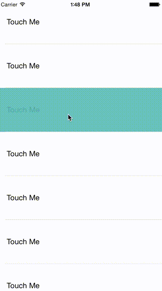

#RLSRippleCell

Swift subclass of the UITableViewCell.

#Screenshot


## Requirements

- iOS 8.0+
- Xcode 6.1


#Installation

Just add the `RLSRippleCell` folder to your project.

#Usage
There is a need to set up your own color `targetColor` and `targetBGcolor` property of the cell.
The targetColor will change to ripple like from touched point in the cell.

1. Create a new UITableViewCell in your storyboard or nib.

2. Set the class of the UITableViewCell to RLSRippleCell in your Storyboard or nib.

3. Set `targetColor` and `targetBGcolor` for the cell.

4. Set `showDuration` property programmatically if You want to change animation duration.


#Example

``` swift
func tableView(tableView: UITableView, cellForRowAtIndexPath indexPath: NSIndexPath) -> UITableViewCell {
    let cell = tableView.dequeueReusableCellWithIdentifier("MyCell", forIndexPath: indexPath) as! RLSRippleCell
    cell.selectedBackgroundView = UIView()
    cell.selectedBackgroundView.backgroundColor = UIColor.clearColor()
    cell.textLabel!.text = " Touch Me "
    return cell
}

```


## Credits

RLSRippleCell is owned and maintained by [RECRUIT LIFESTYLE CO., LTD.](http://www.recruit-lifestyle.co.jp/)

RLSRippleCell was originally created by [Narimasa Iwabuchi](https://github.com/NariFrow)  


##License

    Copyright 2015 RECRUIT LIFESTYLE CO., LTD.

    Licensed under the Apache License, Version 2.0 (the "License");
    you may not use this file except in compliance with the License.
    You may obtain a copy of the License at

       http://www.apache.org/licenses/LICENSE-2.0

    Unless required by applicable law or agreed to in writing, software
    distributed under the License is distributed on an "AS IS" BASIS,
    WITHOUT WARRANTIES OR CONDITIONS OF ANY KIND, either express or implied.
    See the License for the specific language governing permissions and
    limitations under the License.


  
